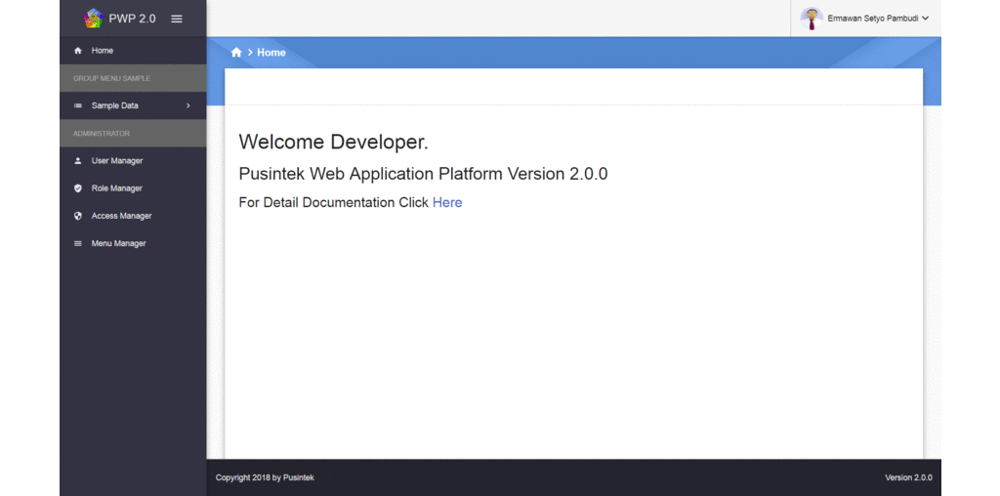

<p align="center">
	  
</p>
<p align="center">**Pusintek Web Application Platform**<br><br></p>

# Screencast
<p align="center">
  
</p>

# Features

- **.NET Core 2.0** — Cross Platform .NET implementation for websites, servers, and console apps on Windows, Linux, and macOS.

- **Angular 4+** — Develop across all platform, Achieve the maximum speed and performance, Incredible tooling, and Loved by Millions.

- **Google's Material Design** — All libraries and custom made components are following **[Google's Material Design Specifications][mat]**.

- **Kemenkeu ID** — Full Integrated with KemenkeuID Single SignOn.

- **RBAC** — Provides a way to manage your application's access control using Role-Based Access Control, included Menu Manager, Role Manager, User Manager adn Access Manager.

[mat]: https://www.google.com/design/spec/material-design/introduction.html

# Installation

### Prerequisites

- **Node.js** - Download and install the latest [Node.js](https://nodejs.org/en) from its web site.

- **.Net Core SDK** - Download and install [.Net Core SDK](https://www.microsoft.com/net/download/windows), includes in Visual Studio 2017 update 3.

### Install SETPPBO

SETPPBO are available as Nuget Package for `(Non Visual Studio IDE User's)` and [VSIX installer](http://dev.ecorp.kemenkeu.go.id/SETPPBO/downloads/SETPPBO.vsix) for `(Visual Studio 2017 User's)`.

#### Install NetCore Template from Nuget Package
```bash
dotnet new i SETPPBO
```
**Create new Project using template**
```bash
dotnet new pwp -o <project-name>
```
**Restore all Node module dependencies**

Go to project directory then: 
```bash
npm install
```
**Run application**

Go to project directory then: 
```bash
dotnet run
```

# License

Copyright (c) 2018 [Pusintek]

[Pusintek]: http://pusintek.kemenkeu.go.id
